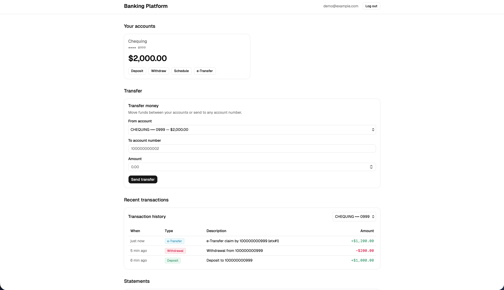
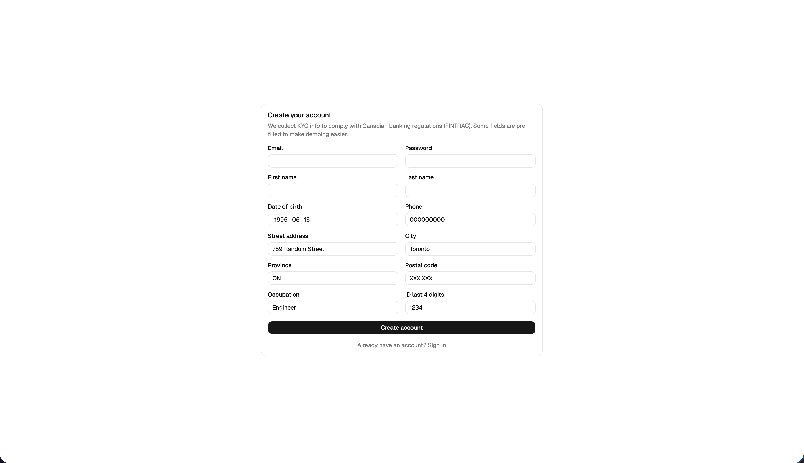

# Banking Platform

A simulated banking management system built to demonstrate the engineering patterns used by core banking systems — double-entry ledger, idempotent transfers, immutable audit log, and concurrency-safe money movement.

> **Note:** This is a learning/portfolio project. No real money, no real PCI compliance. The point is to model how a real bank's backend works.

## Tech stack

- **Backend:** Java 21, Spring Boot 3.5, Spring Data JPA, Spring Security, Flyway
- **Database:** PostgreSQL 16 (Dockerized)
- **Frontend:** React + TypeScript + Vite *(coming soon)*
- **Infrastructure:** Docker Compose, GitHub Actions *(coming soon)*

## Status

🚧 **In active development.** Building session-by-session.

- [x] Session 1 — Project scaffold, Postgres in Docker, Flyway, Actuator health
- [x] Session 2 — Domain models (Customer, UserAccount, Account, AccountHolder, FINTRAC-aligned KYC fields)
- [x] Session 3 — JWT auth (BCrypt, lockout, refresh rotation, theft detection, IDOR-safe /me)
- [x] Session 4 — Double-entry ledger (Money value object, balanced journal entries, idempotency keys, IDOR protection)
- [x] Session 5 — Transfers + concurrency (pessimistic locking, deterministic ID ordering, /api/transactions/me, 100-concurrent load test verified)
- [x] Session 6 — Transaction history, dashboard UI
- [x] Session 7 — Audit log + observability (hash-chained audit, /actuator/prometheus, structured JSON logs, ADR-001)
- [x] Session 8 — Spring Batch + statements (monthly batch job, OpenPDF, hash-resilient retry, customer download, scheduled cron behind feature flag, synthetic data seeder)
- [ ] Session 9 — Role-based access control, scheduled transfers
- [ ] Session 10 — Interac e-Transfer simulation
- [ ] Session 11 — CI/CD, deploy live
- [ ] Session 12 — Polish, architecture diagrams, demo seed data

## Screenshots

### Dashboard

A logged-in customer's view: account cards with masked numbers and live balances,
transfer form, and full transaction history derived from the underlying double-entry ledger.



### Login

JWT-based authentication with refresh-token rotation and lockout protection.


### Register

Full FINTRAC-aligned KYC fields (legal name, DOB, address, ID type, occupation, PEP flag).



## Run it locally

You'll need: Java 21, Maven, Docker, Node 20+.

```bash
# 1. Start Postgres
docker compose up -d

# 2. Backend (in one terminal)
cd backend
mvn spring-boot:run

# 3. Frontend (in another terminal)
cd frontend
npm install
npm run dev
```

Open `http://localhost:5173`. Register a new account, then explore.

## Architecture

*(coming in Session 12 — diagram of services, ledger flow, transfer sequence)*

## License

MIT
